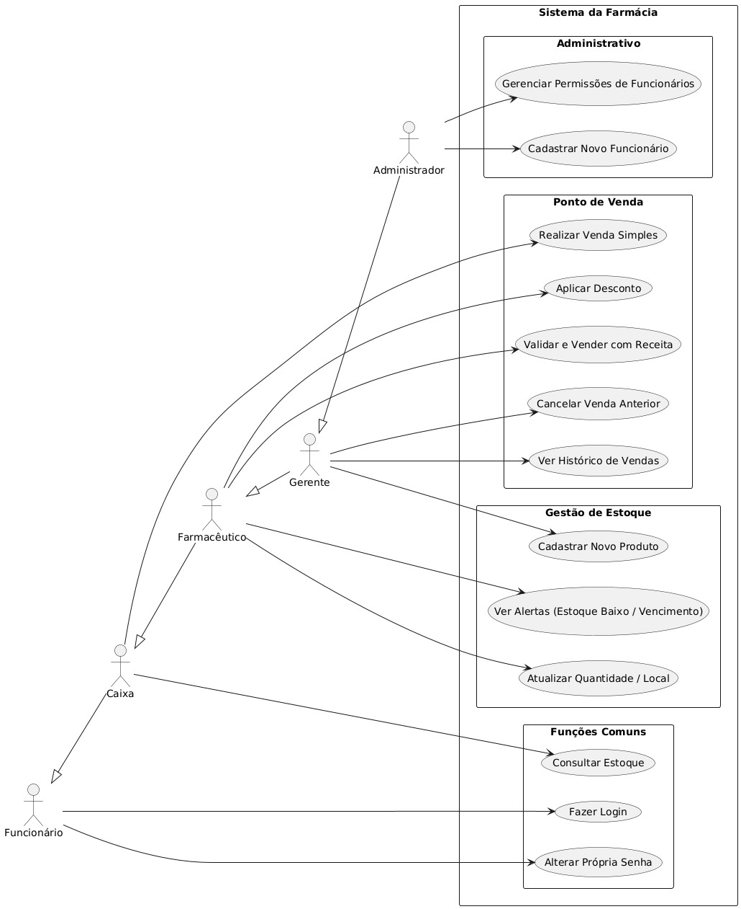
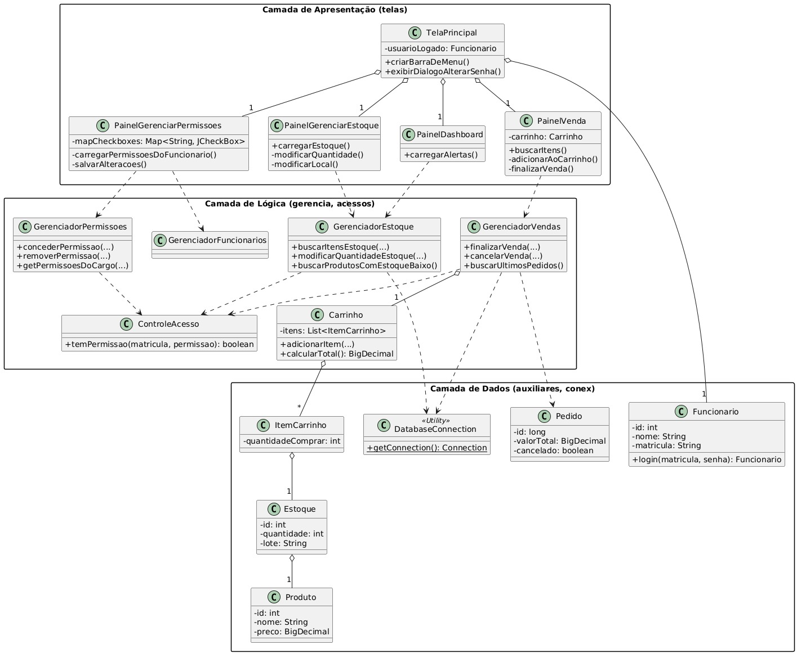

# VALE 10 !!!!!!!

### Christopher Willians Silva Couto - Gu3054047
### Gabriel Vitor Grossi Lourenço - Gu3054446

# Sumário

- [VALE 10 !!!!!!!](#vale-10-)
    - [Christopher Willians Silva Couto - Gu3054047](#christopher-willians-silva-couto---gu3054047)
    - [Gabriel Vitor Grossi Lourenço - Gu3054446](#gabriel-vitor-grossi-lourenço---gu3054446)
- [Sumário](#sumário)
- [Introdução](#introdução)
- [Requisitos de Desenvolvimento](#requisitos-de-desenvolvimento)
- [Estrutura do Projeto](#estrutura-do-projeto)
- [Requisitos Funcionais e não Funcionais](#requisitos-funcionais-e-não-funcionais)
  - [Requisitos Funcionais](#requisitos-funcionais)
  - [Requisitos Não Funcionais](#requisitos-não-funcionais)
- [Banco de Dados](#banco-de-dados)
  - [Tabela Permissões](#tabela-permissões)
  - [Tabelas Cargos](#tabelas-cargos)
  - [Tabela de Funcionários](#tabela-de-funcionários)
  - [Tabela de Produtos](#tabela-de-produtos)
  - [Tabela Áreas do Estoque](#tabela-áreas-do-estoque)
  - [Tabela de Estoque](#tabela-de-estoque)
    - [Relacionamentos (chaves estrangeiras)](#relacionamentos-chaves-estrangeiras)
    - [Principais Campos](#principais-campos)
  - [Tabela de Pedidos](#tabela-de-pedidos)
  - [Tabela Itens do Pedido](#tabela-itens-do-pedido)
- [Tabela de Receitas](#tabela-de-receitas)
  - [Tabela de Profissionais](#tabela-de-profissionais)
- [Diagramas de caso de uso](#diagramas-de-caso-de-uso)
- [Modelo Relacionamento](#modelo-relacionamento)
- [Classes e suas responsabilidades](#classes-e-suas-responsabilidades)
  - [Classes e Requisitos Funcionais](#classes-e-requisitos-funcionais)
  - [Classes e Requisitos Não Funcionais](#classes-e-requisitos-não-funcionais)
  
# Introdução

Criação de um sistema de gerenciamento de estoque para farmácias como projeto final da disciplina de Programação Orientada a Objeto (POO). O intuito deste projeto é o desenvolvimento de um sistema que consiga lidar com o gerenciamento dos funcionários, fluxo de compras e o armazenamento dos produtos, além disso, com uma camada de segurança com base em um sistema de hierarquia de acessos.

Desta forma, como foi requisitado pelo o professor da disciplina, usamos como ferramentas a linguagem de programação o Java para a logica , o banco de dados MySQL para o armazenamento dos dados  e o jQuery para o FrontEnd. Assim, para o cumprimento dos requisitos do projeto, usamos um arquitetura baseada na POO com base em principalmente nas classes do Banco de dados

# Requisitos de Desenvolvimento

- Sistema desenvolvido em Java;
- Banco de Dados MySQL;
- Utilização do jQuery para o FrontEnd;
- Código desenvolvido orientado a objeto;
- Criação de um sistema de verificação de acesso (tela de login) que verifique se as credencias informadas coincidem com as cadastradas na database, em casos de incoerências retorne uma mensagem informando que a senha ou matricula estão incorretas;
- Criação de uma tela ou mais para a utilização das funcionalidades com filtro de acesso de acordo com as regras de hierarquia estabelecidas;
- Documentação do projeto com diagrama de uso e fluxograma;

# Estrutura do Projeto

```
sistema-de-estoque-de-farmacia/
├─ diagrams/
│  ├─ casos-de-uso.plantuml
│  ├─ diagrama-de-classes.plantuml
│  └─ diagrama.mwb
├─ Estoque/
│  ├─ lib/
│  ├─ src/
│  │  ├─ acessos/
│  │  │  ├─ ControleAcesso.java
│  │  │  └─ GerenciadorPermissoes.java
│  │  ├─ auxiliares/
│  │  │  ├─ AreaEstoque.java
│  │  │  ├─ Estoque.java
│  │  │  ├─ Funcionario.java
│  │  │  ├─ ItemCarrinho.java
│  │  │  ├─ Pedido.java
│  │  │  ├─ Produto.java
│  │  │  ├─ Profissional.java
│  │  │  └─ Receita.java
│  │  ├─ conex/
│  │  │  └─ DatabaseConnection.java
│  │  ├─ database/
│  │  │  └─ db.sql
│  │  ├─ gerencia/
│  │  │  ├─ Carrinho.java
│  │  │  ├─ GeradorDeRecibos.java
│  │  │  ├─ GerenciadorEstoque.java
│  │  │  ├─ GerenciadorFuncionarios.java
│  │  │  ├─ GerenciadorProdutos.java
│  │  │  ├─ GerenciadorReceitas.java
│  │  │  └─ GerenciadorVendas.java
│  │  ├─ telas/
│  │  │  ├─ PainelCadastrarFuncionario.java
│  │  │  ├─ PainelCadastroProduto.java
│  │  │  ├─ PainelDashboard.java
│  │  │  ├─ PainelGerenciarEstoque.java
│  │  │  ├─ PainelGerenciarPermissoes.java
│  │  │  ├─ PainelHistoricoVendas.java
│  │  │  ├─ PainelVenda.java
│  │  │  ├─ TelaLogin.java
│  │  │  └─ TelaPrincipal.java
│  │  └─ App.java
│  ├─ .classpath
│  └─ mysql-connector-j-9.3.0.jar
├─ .gitignore
├─ .project
└─ README.md
```

A estrutura do seu projeto "Sistema de Estoque de Farmácia" é organizada de forma modular, seguindo uma divisão clara de responsabilidades para facilitar o desenvolvimento, a manutenção e a escalabilidade. Ela é composta por quatro grupos principais de classes e recursos:

- **Classes de Exibição (`telas/`):**
    
    - **Responsabilidade:** Estas classes são o **frontend** da aplicação [informação fornecida pelo usuário]. Elas são responsáveis por construir e apresentar a interface gráfica do usuário (GUI) utilizando a biblioteca Swing do Java. Gerenciam a interação direta com o usuário, coletando entradas (cliques em botões, dados em campos de texto) e exibindo os resultados das operações do sistema. Elas servem como a camada de apresentação, traduzindo os dados e a lógica de negócio em elementos visuais compreensíveis para o usuário.

- **Classes de Gerenciamento (`gerencia/`):**
    
    - **Responsabilidade:** Estas classes são o **coração da lógica de negócio** do sistema [informação fornecida pelo usuário]. Elas orquestram as operações complexas, manipulam os dados e impõem as regras de negócio. Atuam como uma camada intermediária entre as classes de exibição (frontend) e as classes de acesso a dados/auxiliares, garantindo que as ações solicitadas pelo usuário sejam processadas corretamente e de forma consistente, muitas vezes envolvendo múltiplas interações com o banco de dados.

- **Classes Auxiliares (`auxiliares/`):**
    
    - **Responsabilidade:** Este grupo contém classes que representam as **entidades de dados (modelos)** do sistema. Elas são POJOs (Plain Old Java Objects) que modelam os objetos do mundo real com seus atributos e, em alguns casos, comportamentos básicos relacionados a si mesmos (como getters e setters). São fundamentais para passar dados entre as diferentes camadas da aplicação.

- **Classes de Acesso a Dados e Segurança (`conex/` e `acessos/`):**
    
	- **Responsabilidade Principal:** Este grupo de classes é o **guardião da integridade e da segurança operacional** do sistema. Ele atua como uma camada fundamental que interage diretamente com o banco de dados para a persistência e recuperação de informações, e, crucialmente, impõe as **regras de segurança e autorização** que governam quem pode fazer o quê no sistema.
	    
	- **Componentes e Suas Funções Detalhadas:**
	    
	    - **`DatabaseConnection.java` (`conex/`):**
	        
	        - Esta é a classe de utilidade que **estabelece e gerencia as conexões com o banco de dados**. Sua função é centralizar os detalhes técnicos de conexão (URL, credenciais), garantindo que outras partes do sistema possam acessar os dados de forma simplificada e consistente, sem precisar lidar com a complexidade de baixo nível da conectividade JDBC. É a ponte essencial para qualquer operação de leitura ou escrita que o sistema precise realizar no banco.
	            
	    - **`ControleAcesso.java` (`acessos/`):**
	        
	        - Esta classe é o **pilar da segurança funcional do sistema**. Sua responsabilidade primordial é **verificar se o funcionário logado possui o acesso necessário para executar determinada operação**. Ela age como um "porteiro" inteligente: antes que qualquer lógica de negócio sensível seja executada (como finalizar uma venda, modificar o estoque ou cadastrar um novo funcionário), o `ControleAcesso` é consultado para validar se o usuário em questão tem a permissão específica exigida para aquela ação. Por ser a **base de todas as outras classes** que requerem validação de privilégios, ela é **utilizada em praticamente todo o programa**, garantindo que as regras de segurança sejam aplicadas de forma uniforme e rigorosa em todas as camadas da aplicação que interagem com dados ou funcionalidades restritas.
	            
	    - **`GerenciadorPermissoes.java` (`acessos/`):**
	        
	        - Esta classe, embora também ligada ao acesso, tem uma responsabilidade mais focada na **modificação, adição ou remoção de permissões de cargos específicos**. Ela é a ferramenta administrativa para ajustar as capacidades de diferentes perfis de usuário no sistema. Suas funções incluem `concederPermissao` e `removerPermissao` para habilitar ou desabilitar funcionalidades para um cargo. Além disso, ela carrega as permissões válidas diretamente do banco de dados e implementa **regras de hierarquia complexas e de segurança rígida**, garantindo que apenas usuários com os mais altos privilégios (e que respeitam certas restrições hierárquicas) possam alterar as permissões de outros cargos. É crucial, por exemplo, na configuração inicial de um novo tipo de cargo ou na manutenção dos privilégios existentes.

# Requisitos Funcionais e não Funcionais 

## Requisitos Funcionais

1.  **Autenticação de Usuários:** 

	- Permitir que funcionários se autentiquem usando matrícula e senha.
    
2.  **Gerenciamento de Produtos:**
    
    - Cadastro de Novos Produtos: Permitir o cadastro de novos produtos.
    
3.  **Gerenciamento de Estoque:**
    
    - Consulta de Itens do Estoque: Permitir a busca e visualização de itens do estoque por nome do produto.
    - Modificação de Quantidade do Estoque: Permitir a alteração da quantidade de um item no estoque.
    - Modificação de Local de Estoque: Permitir a alteração da área de armazenamento de um item.
    - Adição de Lote de Estoque: Permitir a adição de novos lotes a produtos existentes.
    - Alertas de Estoque Baixo: Exibir alertas para produtos com quantidade abaixo do mínimo.
    - Alertas de Produtos Próximos do Vencimento: Exibir alertas para produtos com data de validade próxima.
        
4.  **Processamento de Vendas:**
    
    - Adição de Itens ao Carrinho: Permitir adicionar produtos ao carrinho de compras.
    - Exigência e Coleta de Dados de Receita: Verificar se um produto exige receita e, em caso afirmativo, coletar os dados da receita e do profissional.
    - Finalização de Venda: Permitir finalizar uma venda, registrando o pedido, os itens e dando baixa no estoque.
    - Geração de Recibos: Gerar um recibo detalhado da venda.
    - Cancelamento de Venda: Permitir o cancelamento de uma venda e a devolução dos itens ao estoque.
    - Aplicação de Desconto: Permitir aplicar descontos percentuais a uma venda.
    
5. **Histórico de Vendas:**

	- Exibir um histórico das vendas realizadas.
    
6. **Gerenciamento de Funcionários:**
    
    - Cadastro de Funcionários: Permitir o cadastro de novos funcionários com atribuição de cargo e permissões.    
    - Edição de Dados de Funcionários: Permitir a edição de informações de funcionários.
    - Desativação de Funcionários: Permitir desativar a conta de um funcionário.
    - Alteração de Senha do Próprio Funcionário: Permitir que o funcionário altere sua própria senha.
    
7.  **Gerenciamento de Permissões:**

	- Permitir que usuários autorizados concedam ou removam permissões para cargos.

## Requisitos Não Funcionais

- **Segurança e Controle de Acesso (Autorização):** Garantir que as operações críticas sejam realizadas apenas por usuários com as permissões adequadas.
    
- **Confiabilidade (Transações):** Garantir que as operações de escrita no banco de dados sejam atômicas, consistentes, isoladas e duráveis (ACID).
    
- **Usabilidade:** Ser fácil de usar e intuitivo para os funcionários.
    
- **Persistência de Dados:** Armazenar todos os dados relevantes de forma persistente.
    
- **Manutenibilidade:** Ter um código modular e fácil de entender e modificar.
    
- **Portabilidade (Parcial):** Ser capaz de rodar em diferentes sistemas operacionais.
# Banco de Dados

```sql
CREATE DATABASE IF NOT EXISTS Farma_IFSP DEFAULT CHARACTER SET utf8;

use Farma_IFSP;
```

criação do banco de dados no padrão utf8 e o uso do mesmo

## Tabela Permissões

```sql
CREATE TABLE IF NOT EXISTS Permissoes (

    id INT AUTO_INCREMENT PRIMARY KEY,

    nome ENUM('Permissao_Farmaceutico', 'Permissao_Gerente', 'Permissao_Admin', 'Permissao_Caixa') NOT NULL,

    cadastrar_funcionarios BOOLEAN NOT NULL DEFAULT FALSE,
......

);
```

Essa tabela é responsável pela criação de permissões que um determinado funcionário pode ter, desta forma para cada novo funcionário é feita uma inserção nesse tabela com as permissões dele e o tipo de permissão que ele tem, decidimos utilizar essa arquitetura, pois podemos criar funcionários tantos permissões padrões de acordo com um cargo como também personalizar elas.

## Tabelas Cargos

```sql
CREATE TABLE if not exists Cargos (

    id INT AUTO_INCREMENT PRIMARY KEY,

    nome ENUM('Administrador', 'Caixa', 'Farmaceutico', 'Gerente') NOT NULL,

    id_permissao INT NULL,

    FOREIGN KEY (id_permissao) REFERENCES Permissoes(id)

);
```


Essa tabela é onde definimos os cargos que podem existir na farmácia, desta forma, para cada funcionário é feita uma inserção nela e vinculada a linha da ***tabela de Permissões*** (por meio do campo `id_permissao` ) que equivale a um determinado funcionário.

## Tabela de Funcionários

```sql
CREATE Table if not exists Funcionarios(

    id INT AUTO_INCREMENT primary key,

    nome VARCHAR(255) NOT NULL,

    cpf VARCHAR(255) NOT NULL UNIQUE,

    matricula VARCHAR(255) NOT NULL UNIQUE,

    email VARCHAR(255) NOT NULL UNIQUE,

    telefone VARCHAR(255) NOT NULL,

    senha VARCHAR(255) NOT NULL,

    tipo ENUM('funcionario', 'adm', 'dono') NOT NULL DEFAULT 'funcionario',

    id_cargo int NULL,    

    atividade VARCHAR(255) NOT NULL DEFAULT 'ativo',

    created_at TIMESTAMP DEFAULT CURRENT_TIMESTAMP,

    updated_at TIMESTAMP DEFAULT CURRENT_TIMESTAMP ON UPDATE CURRENT_TIMESTAMP,

    Foreign Key (id_cargo) REFERENCES Cargos (id)

);
```

Essa é a tabela responsável por cadastrar as informações do funcionários, nela temos os campos senha e matricula que são usados para validação de acesso ao sistema e funções. Além disso, usamos o campo campo tipo para saber a quem pertence a linha (uma vez que podemos ter administradores que não são o dono do  estabelecimento) e o campo atividade que define se o usuário esta ativo ou não (útil para  saber se ele esta de férias ou foi desligado da empresa).

Nesse contexto, temos a ligação com a ***tabela Cargos*** por meio do campo `id_cargo`, que pro sua é vinculada a um campo da ***tabela de Permissões***, assim criando um encadeamento que tem todas as informações de um colaborador. 

## Tabela de Produtos

```sql
create table if not exists Produtos(

    id INT AUTO_INCREMENT primary key,

    nome VARCHAR(255) NOT NULL,

    descricao VARCHAR(255) NOT NULL,

    armazenamento VARCHAR(255) NOT NULL,

    armazenamento_especial ENUM('sim', 'nao') NOT NULL DEFAULT 'nao',

    receita_obrigatoria ENUM('sim', 'nao') NOT NULL DEFAULT 'nao',

    fabricante VARCHAR(255) NOT NULL,

    categoria ENUM('medicamento', 'antibiotico', 'higiene', 'cosmetico', 'suplemento', 'materiais_medicos', 'infantil', 'dermocosmetico', 'outros') NOT NULL,

    tarja ENUM('vermelha', 'preta', 'amarela', 'isento') NOT NULL DEFAULT 'isento',

    preco DECIMAL(10, 2) NOT NULL,

    created_at TIMESTAMP DEFAULT CURRENT_TIMESTAMP,

    updated_at TIMESTAMP DEFAULT CURRENT_TIMESTAMP ON UPDATE CURRENT_TIMESTAMP

);
```

Essa tabela é onde fica cadastrado todo os produtos da loja, nela temo o 4 campos principais, sendo eles:

 - ***armazenamento_especial:*** onde definimos se o medicamento ou produto necessita de um armazenamento especial, como um local refrigerado por exemplo.
 - ***receita_obrigatoria:*** campo utilizado para produtos que necessitam de receitas para a sua venda, ele é usado para que o vendedor tome ciência que tem que validar e retor a receita.
 - ***categoria:*** usado para saber  a qual grupo de produtos ele pertence.
 - ***tarja:*** para que em caso de receita obrigatória o vendedor tenha o conhecimento do tipo de receita necessária para que a sua venda seja autorizada. 

## Tabela Áreas do Estoque

```sql
create table if not EXISTS Areas_estoque(

    id int AUTO_INCREMENT PRIMARY KEY,

    setor VARCHAR(255) NOT NULL,

    andar VARCHAR(255) NOT NULL,

    tipo_armazenamento ENUM('padrao', 'refrigerado', 'frigorifico')  not NULL DEFAULT 'padrao',

    prateleira VARCHAR(255) NOT NULL

);
```

Essa tabela é responsável por armazenar os locais de armazenamento dos produtos.

## Tabela de Estoque

```sql
create table if not EXISTS Estoque(

    id int AUTO_INCREMENT PRIMARY KEY,

    id_produto int not null,

    id_local int not NULL,

    quantidade int,

    lote VARCHAR(255) NOT NULL,

    data_fabricacao DATE NOT NULL,

    data_validade DATE NOT NULL,

    local_armazenado text,

    nfCompra    text,

    precoCompra     decimal(15,2),

    icmsCompra  decimal(15,2),

    precoVenda  decimal(15,2),

    desconto ENUM('sim', 'nao') NOT NULL DEFAULT 'nao',

    desconto_padrao decimal(15,2),

    venda_desconto int, -- aqui seria o desconto do convenio que é varival, pode ser valor ou porcentagem

    tipo_venda_desconto ENUM('valor', 'porcentagem') NOT NULL DEFAULT 'valor',

    qtdVendida  int,

    qtdOcorrencia int,

    qtd_minima INT DEFAULT 0,

    ocorrencia  varchar(1024),

    Foreign Key (id_produto) REFERENCES Produtos (id),

    Foreign Key (id_local) REFERENCES Areas_estoque (id)

);
```

A ***tabela Estoque*** armazena todas as informações relacionadas aos **lotes de produtos** disponíveis na farmácia. Cada registro representa um lote específico, controlando desde a **quantidade** até a **validade**, **localização**, **preços**, **descontos**, **vendas** e **ocorrências**.

### Relacionamentos (chaves estrangeiras)

- **`id_produto`** → _Referência à tabela `Produtos`_:  
    Liga o item do estoque ao produto cadastrado. Permite saber o nome, categoria, fabricante, exigência de receita e outras informações importantes do produto associado ao lote.
    
- **`id_local`** →  _Referência à tabela `Areas_estoque`_:  
    Define **onde fisicamente** o produto está armazenado dentro da farmácia (como prateleira, setor, andar e tipo de armazenamento). Esse campo garante controle preciso sobre a localização física do item.


###  Principais Campos

- **`lote`, `data_fabricacao`, `data_validade`:** controle da rastreabilidade e validade.
- **`precoCompra`, `precoVenda`, `icmsCompra`:** controle financeiro e tributário por lote.
- **`desconto`, `desconto_padrao`, `tipo_venda_desconto`:** controle de descontos simples ou por convênios.
- **`qtdVendida`, `qtd_minima`:** controle de saída e alertas de reposição.
- **`ocorrencia`, `qtdOcorrencia`:** registro de problemas como perdas, avarias ou produtos vencidos.
- **`local_armazenado`:** detalhamento do armazenamento caso necessário. 

## Tabela de Pedidos

```c
CREATE TABLE if not exists Pedidos (

    id int AUTO_INCREMENT PRIMARY KEY,

    dtPedido datetime,

    receita ENUM('sim', 'nao') NOT NULL DEFAULT 'nao',

    receita_especial ENUM('sim', 'nao') NOT NULL DEFAULT 'nao',

    dtPagamento datetime,

    dtNotaFiscal datetime,

    notaFiscal text,

    dtRecebimento datetime,

    valorTotal decimal(12,2),

    sub_total DECIMAL(12,2),  

    qtdItems int,

    forma_pagamento ENUM('dinheiro', 'cartao_credito', 'cartao_debito', 'pix', 'boleto', 'outro') NOT NULL,

    quantidade_parcelas int,

    dtDevolucao datetime,

    motivoDevolucao text

);
```

A ***tabela Pedidos*** é responsável por armazenar os dados de cada venda ou compra realizada na farmácia. Cada linha representa um pedido completo e contém informações como a data do pedido (`dtPedido`), o valor total (`valorTotal`), a quantidade de itens (`qtdItems`) e o subtotal (`sub_total`), que pode refletir descontos aplicados.

Além disso, essa tabela permite controlar detalhes importantes como a forma de pagamento utilizada (`forma_pagamento`) e o número de parcelas (`quantidade_parcelas`) em casos de pagamento a prazo. Também registra o status de devoluções, por meio dos campos `dtDevolucao` e `motivoDevolucao`.

Há dois campos específicos para controle de medicamentos com prescrição: `receita` e `receita_especial`, que indicam se o pedido envolveu algum produto que exige apresentação de receita comum ou controlada. Os campos `dtPagamento`, `dtNotaFiscal` e `dtRecebimento` servem para acompanhar o fluxo completo da transação, desde a emissão até o recebimento e registro fiscal, que pode ser descrito em `notaFiscal`.

Por fim, essa tabela se relaciona com outras como `Itens_pedido`, que detalha os produtos envolvidos em cada pedido, e `Receitas`, no caso de vendas com prescrição médica, permitindo o rastreamento completo de operações comerciais e regulamentadas.

## Tabela Itens do Pedido

```sql
CREATE Table if NOT exists Itens_pedido(

    id int AUTO_INCREMENT PRIMARY KEY,

    id_pedido int not NULL,

    id_estoque int not NULL,

    id_receita int,

    id_produto int not NULL,

    quantidade int not NULL,

    preco_unitario decimal(15,2) NOT NULL,

    sub_total decimal(15,2), -- caso tenha desconto

    Foreign Key (id_produto) REFERENCES Produtos (id),

    FOREIGN KEY (id_pedido) REFERENCES Pedidos(id),

    Foreign Key (id_estoque) REFERENCES Estoque (id)

);
```

A ***tabela Itens_pedido*** registra os produtos incluídos em cada pedido realizado na farmácia. Cada linha representa um item específico do pedido, ligando-o a um produto (`id_produto`), a um lote do estoque (`id_estoque`) e, se aplicável, a uma receita (`id_receita`). Ela também armazena a quantidade vendida, o preço unitário e o subtotal daquele item, considerando possíveis descontos. 

# Tabela de Receitas

```sql
CREATE TABLE IF NOT EXISTS Receitas(

    id int AUTO_INCREMENT PRIMARY KEY,

    id_funcionario int NOT NULL,

    id_pedido int NOT NULL,

    tipo ENUM('Receita Azul (Receituário de Controle Especial - Tipo A)', 'Receita Verde (Receituário de Controle Especial - Tipo B)', 'Receita Amarela (Notificação de Receita - Tipo A)', 'Receita Branca Comum (Simples)', 'Receita Branca de Controle Especial (Receituário de Controle Especial)') not null,

    codigo VARCHAR(255) not NULL,

    cpf_paciente VARCHAR(255) NOT NULL,

    nome_paciente VARCHAR(255) NOT NULL,

    data_nascimento DATE NOT NULL,

    data_validade DATE NOT NULL,

    observacoes TEXT,

    data_emissao TIMESTAMP DEFAULT CURRENT_TIMESTAMP,

    FOREIGN KEY (id_funcionario) REFERENCES Funcionarios(id),

    FOREIGN KEY (id_pedido) REFERENCES Pedidos(id)

);
```

A ***tabela Receitas*** armazena as informações das prescrições médicas associadas a pedidos de medicamentos que exigem controle. Cada registro inclui dados do funcionário que analisou a receita (`id_funcionario`), o pedido ao qual ela está vinculada (`id_pedido`), o tipo de receita (como azul, branca, amarela, etc.), o paciente (nome, CPF, nascimento) e dados da validade e emissão da receita.

## Tabela de Profissionais

```sql
CREATE TABLE IF NOT EXISTS Profissional(

    id INT PRIMARY KEY AUTO_INCREMENT,

    id_receita INT NOT NULL,

    nome_profissional VARCHAR(100),

    tipo_registro ENUM('CRM', 'COFEN', 'CRO', 'CRF', 'OUTRO'),

    numero_registro VARCHAR(20),

    uf_registro CHAR(2),

    data_emissao DATE,

    especialidade VARCHAR(100),

    created_at TIMESTAMP DEFAULT CURRENT_TIMESTAMP,

    updated_at TIMESTAMP DEFAULT CURRENT_TIMESTAMP ON UPDATE CURRENT_TIMESTAMP,

    FOREIGN KEY (id_receita) REFERENCES Receitas(id) ON DELETE CASCADE

);
```

A ***tabela Profissional*** complementa os dados das receitas com informações do profissional de saúde responsável pela prescrição. Ela inclui o nome do profissional, o tipo e número do registro (CRM, COFEN, etc.), estado de emissão, especialidade e a data da emissão do documento. Cada profissional está vinculado a uma receita específica (`id_receita`), e a tabela garante que os dados da prescrição tenham origem em um profissional habilitado, conforme exigências legais.

# Diagramas de caso de uso



# Modelo Relacionamento 



# Classes e suas responsabilidades

## Classes e Requisitos Funcionais


- **Autenticação de Usuários:** O sistema deve permitir que funcionários se autentiquem usando sua matrícula e senha.

    - **Aplicação no código:** O processo de autenticação é centralizado na classe `Funcionario`, que possui um método estático `login`. Este método é responsável por se conectar ao banco de dados, especificamente às tabelas `Funcionarios` e `Cargos`. Ele verifica se a matrícula e a senha fornecidas correspondem a um registro existente e se o funcionário está com o status 'ativo' no sistema. Se as credenciais forem válidas, um objeto `Funcionario` completo é retornado, contendo todos os dados do usuário logado, incluindo seu cargo. A interface de usuário para essa funcionalidade é a `TelaLogin`, que coleta a matrícula e a senha do usuário e aciona o método de login. Em caso de sucesso, ela direciona o usuário para a `TelaPrincipal` do sistema.

- **Gerenciamento de Produtos:**

    - **Cadastro de Novos Produtos:** O sistema deve permitir que funcionários autorizados cadastrem novos produtos na base de dados.

        - **Aplicação no código:** A funcionalidade de cadastro de produtos é orquestrada pela classe `GerenciadorProdutos`. Ela expõe o método `cadastrarNovoProduto`, que recebe um objeto `Produto` com as informações a serem persistidas. Antes de realizar a inserção, o sistema verifica se o funcionário que está executando a operação possui a permissão "supervisionar_estoque" através do `ControleAcesso`. Os dados são então inseridos na tabela `Produtos` no banco de dados. O `PainelCadastroProduto` serve como a interface gráfica para esta operação, fornecendo campos para o usuário inserir o nome, descrição, fabricante, preço, categoria, tarja e indicar se o produto exige receita médica.

- **Gerenciamento de Estoque:**

    - **Consulta de Itens do Estoque:** O sistema deve permitir que usuários consultem e visualizem os itens disponíveis no estoque.

        - **Aplicação no código:** A classe `GerenciadorEstoque` é responsável por buscar os itens do estoque. O método `buscarItensEstoque` recebe um nome de produto (ou parte dele) e o funcionário que realiza a busca, efetuando uma consulta nas tabelas `Estoque`, `Produtos` e `Areas_estoque` para retornar informações detalhadas sobre os itens, incluindo sua localização e quantidade. A permissão "consultar_estoque" é verificada para garantir que apenas usuários autorizados possam acessar essas informações. O `PainelGerenciarEstoque` é a interface que exibe esses dados em uma tabela, permitindo que os usuários vejam o inventário atual da farmácia.

    - **Modificação de Quantidade do Estoque:** O sistema deve permitir a alteração manual da quantidade de um item específico no estoque.

        - **Aplicação no código:** A alteração da quantidade de itens em estoque é controlada pelo método `modificarQuantidadeEstoque` na classe `GerenciadorEstoque`. Este método valida se a nova quantidade não é negativa e, crucialmente, verifica se o funcionário executando a operação possui a permissão "atualizar_estoque". Após as validações, a quantidade é atualizada diretamente na tabela `Estoque` no banco de dados. O `PainelGerenciarEstoque` oferece uma opção para que o usuário selecione um item na tabela e insira a nova quantidade desejada.

    - **Modificação de Local de Estoque:** O sistema deve permitir a realocação de um item do estoque para uma área de armazenamento diferente.

        - **Aplicação no código:** A função de mudar o local de armazenamento de um produto é gerenciada pelo método `modificarLocalEstoque` na classe `GerenciadorEstoque`. Similar à modificação de quantidade, exige a permissão "atualizar_estoque" do funcionário. O método atualiza o `id_local` correspondente na tabela `Estoque`. O `PainelGerenciarEstoque` permite que o usuário selecione um item e, em seguida, escolha uma nova área de estoque a partir de uma lista de `Areas_estoque` disponíveis, que são buscadas do banco de dados.

    - **Adição de Lote de Estoque:** O sistema deve permitir a inclusão de novos lotes de produtos já existentes no inventário.

        - **Aplicação no código:** Para adicionar um novo lote de estoque, o método `adicionarLoteDeEstoque` da classe `GerenciadorEstoque` é utilizado. Este método insere um novo registro na tabela `Estoque`, associando-o a um produto existente, uma área de estoque específica, quantidade, lote, data de fabricação e validade, além da quantidade mínima. A permissão "atualizar_estoque" é mandatório para esta operação. Após o cadastro inicial de um produto no `PainelCadastroProduto`, o sistema solicita os dados do lote inicial, integrando o processo de cadastro de produto com a entrada de seu primeiro lote em estoque.

    - **Alertas de Estoque Baixo:** O sistema deve alertar sobre produtos cujas quantidades estejam abaixo do nível mínimo de estoque pré-definido.

        - **Aplicação no código:** A classe `GerenciadorEstoque` implementa o método `buscarProdutosComEstoqueBaixo`, que consulta a tabela `Estoque` para identificar itens onde a `quantidade` é menor ou igual à `qtd_minima`. O `PainelDashboard` é a área do sistema designada para exibir esses alertas de forma proeminente, fornecendo uma visão rápida dos produtos que necessitam de reposição.

    - **Alertas de Produtos Próximos do Vencimento:** O sistema deve emitir alertas para produtos com data de validade próxima ao vencimento.

        - **Aplicação no código:** O método `buscarProdutosProximosDoVencimento` em `GerenciadorEstoque` é responsável por essa verificação. Ele filtra os registros da tabela `Estoque` com base na `data_validade`, buscando itens que vencerão dentro de um período configurável (por exemplo, 60 dias) a partir da data atual. Assim como os alertas de estoque baixo, essas informações são apresentadas no `PainelDashboard`, permitindo que a equipe tome as medidas necessárias antes do vencimento.

- **Processamento de Vendas:**

    - **Adição de Itens ao Carrinho:** O sistema deve permitir que os produtos sejam adicionados ao carrinho de compras para processamento da venda.

        - **Aplicação no código:** A classe `Carrinho` encapsula a lógica do carrinho de compras. O método `adicionarItem` permite incluir um `Estoque` (produto com suas informações de lote e preço) e a quantidade desejada. Ele também verifica se a quantidade solicitada não excede o estoque disponível. Se o item já estiver no carrinho, a quantidade é apenas atualizada. O `PainelVenda` é a interface onde os usuários buscam produtos e os adicionam ao carrinho, refletindo as alterações visualmente.

    - **Exigência e Coleta de Dados de Receita:** O sistema deve identificar se um produto requer receita médica e, em caso positivo, solicitar e coletar os dados pertinentes da receita e do profissional.

        - **Aplicação no código:** Antes de adicionar um produto ao carrinho, o sistema utiliza o método `produtoExigeReceita` da classe `GerenciadorEstoque` para verificar a obrigatoriedade da receita com base na informação do `Produto`. Se a receita for obrigatória, o `PainelVenda` verifica se o funcionário logado possui a permissão "analisar_receita". Em caso afirmativo, um diálogo específico é exibido para coletar todos os dados necessários da receita (tipo, código, informações do paciente, datas de nascimento e validade) e do profissional de saúde (nome, tipo e número de registro), que são armazenados em objetos `Receita` e `Profissional` para serem vinculados à venda.

    - **Finalização de Venda:** O sistema deve possibilitar a conclusão de uma transação de venda, registrando-a e atualizando o estoque.

        - **Aplicação no código:** A operação de finalização da venda é complexa e é gerenciada pelo método `finalizarVenda` na classe `GerenciadorVendas`. Esta funcionalidade exige a permissão "finalizar_venda" do executor. Ela é executada dentro de uma transação de banco de dados para garantir a atomicidade: primeiro, um novo registro é criado na tabela `Pedidos` com detalhes da venda (valor total, forma de pagamento, etc.). Em seguida, se houver, os dados da `Receita` e do `Profissional` são persistidos usando o `GerenciadorReceitas`. Depois, cada `ItemCarrinho` é inserido na tabela `Itens_pedido`, e as quantidades dos produtos correspondentes são decrementadas na tabela `Estoque`. Em caso de qualquer falha (por exemplo, estoque insuficiente), toda a transação é revertida. Após o sucesso, o carrinho é limpo e a interface de vendas no `PainelVenda` é atualizada.

    - **Geração de Recibos:** O sistema deve ser capaz de gerar um recibo detalhado para cada venda concluída.

        - **Aplicação no código:** A classe `GeradorDeRecibos` contém a lógica para formatar e gerar o recibo. O método `gerarReciboVenda` recebe o ID de um pedido e consulta as tabelas `Pedidos` e `Itens_pedido` para recuperar todas as informações necessárias, como produtos vendidos, quantidades, preços unitários, subtotal, valor do desconto, total final e forma de pagamento. O recibo é então formatado como uma string de texto, que é exibida em um `JTextArea` dentro de um `JOptionPane` pelo `PainelVenda` imediatamente após a finalização bem-sucedida de uma venda.

    - **Cancelamento de Venda:** O sistema deve permitir o cancelamento de uma venda anteriormente registrada, com a devolução dos itens ao estoque.

        - **Aplicação no código:** A funcionalidade de cancelamento de venda é implementada no método `cancelarVenda` da classe `GerenciadorVendas`. Para executar esta ação, o funcionário deve ter a permissão "autorizar_reembolso". A operação é encapsulada em uma transação para garantir que, ou todos os passos sejam concluídos, ou nenhum seja. O sistema primeiro verifica se o pedido já não foi cancelado. Em seguida, ele busca os itens associados ao pedido e incrementa suas quantidades de volta na tabela `Estoque`. Finalmente, o pedido é marcado como devolvido/cancelado na tabela `Pedidos`. O `PainelVenda` permite que um usuário insira o ID de um pedido para iniciar o processo de cancelamento.

    - **Aplicação de Desconto:** O sistema deve permitir a aplicação de um percentual de desconto sobre o valor total do carrinho de compras.

        - **Aplicação no código:** A classe `Carrinho` é responsável por gerenciar a aplicação de descontos. O método `aplicarDesconto` recebe um valor percentual e o armazena, recalculando o subtotal, o valor do desconto e o total final da compra. A permissão "aplicar_desconto" é verificada antes de permitir que um funcionário realize essa ação no `PainelVenda`. A interface de vendas atualiza os rótulos de desconto e total para refletir o novo cálculo.

- **Histórico de Vendas:** O sistema deve exibir um histórico das vendas realizadas.

    - **Aplicação no código:** A classe `GerenciadorVendas` oferece o método `buscarUltimosPedidos`, que recupera um número limitado de vendas mais recentes da tabela `Pedidos` do banco de dados. O `PainelHistoricoVendas` é a interface de usuário dedicada a apresentar esses dados em uma tabela, permitindo que os usuários visualizem informações como ID do pedido, data, valor total, forma de pagamento e status (finalizado ou cancelado). Também é possível visualizar o recibo detalhado de qualquer pedido selecionado a partir desta tela.

- **Gerenciamento de Funcionários:**

    - **Cadastro de Funcionários:** O sistema deve permitir o cadastro de novos funcionários com a atribuição de um cargo e suas permissões correspondentes.

        - **Aplicação no código:** A classe `GerenciadorFuncionarios` é a responsável por essa funcionalidade. O método `cadastrarFuncionario` é invocado para inserir os dados do novo funcionário. Antes de prosseguir, uma verificação é feita através do `ControleAcesso` para garantir que o funcionário executor tenha a permissão "cadastrar_funcionarios". O processo inclui a criação de um tipo de permissão padrão (Administrador, Gerente, Farmacêutico, Caixa) usando o `GerenciadorPermissoes`, a criação de um cargo personalizado associado a essas permissões, e a inserção final dos dados do funcionário nas tabelas `Funcionarios`, `Cargos` e `Permissoes` de forma transacional para garantir a integridade. O `PainelCadastrarFuncionario` fornece a interface gráfica para coletar todas as informações necessárias.

    - **Edição de Dados de Funcionários:** O sistema deve permitir que usuários autorizados editem as informações de funcionários existentes.

        - **Aplicação no código:** A edição de dados de funcionários é realizada pelo método `editarFuncionario` na classe `GerenciadorFuncionarios`. Este método exige que o funcionário que está realizando a modificação possua a permissão "cadastrar_funcionarios". Ele atualiza os campos de um funcionário específico (nome, CPF, email, telefone, tipo) na tabela `Funcionarios` do banco de dados com base na matrícula alvo. O sistema também trata casos onde o CPF ou e-mail já existam para outro funcionário ativo, prevenindo duplicidades. (Embora uma interface gráfica específica para edição de funcionários não tenha sido fornecida nos arquivos, a lógica de negócio para a edição está plenamente implementada).

    - **Desativação de Funcionários:** O sistema deve permitir que usuários autorizados desativem a conta de um funcionário, impedindo seu acesso futuro.

        - **Aplicação no código:** A desativação de uma conta de funcionário é controlada pelo método `desativarFuncionario` na classe `GerenciadorFuncionarios`. Para que a operação seja permitida, o funcionário executor deve possuir a permissão "controlar_acesso_funcionarios". O método atualiza o status de `atividade` do funcionário na tabela `Funcionarios` para 'inativo', efetivamente bloqueando seu acesso ao sistema. O sistema verifica se o funcionário alvo existe e está ativo antes de tentar a desativação. (Similar à edição, a interface gráfica para desativação não foi explicitamente fornecida, mas a lógica está presente).

    - **Alteração de Senha do Próprio Funcionário:** O sistema deve permitir que um funcionário altere sua própria senha de acesso.

        - **Aplicação no código:** A alteração de senha é tratada pelo método `alterarPropriaSenha` na classe `GerenciadorFuncionarios`. Este método valida a nova senha (não pode ser vazia) e, crucialmente, verifica se a "senha antiga" fornecida corresponde à senha atual do funcionário no banco de dados. Se a verificação for bem-sucedida, a senha é atualizada na tabela `Funcionarios`. A `TelaPrincipal` fornece uma opção de menu ("Alterar Senha") que abre um diálogo para que o funcionário insira a senha antiga e defina e confirme a nova senha, garantindo a segurança do processo.

- **Gerenciamento de Permissões:** O sistema deve permitir que usuários autorizados concedam ou removam permissões para cargos existentes.

    - **Aplicação no código:** A classe `GerenciadorPermissoes` é a responsável por controlar e modificar as permissões. Ela contém métodos como `concederPermissao` e `removerPermissao` que atualizam as colunas booleanas correspondentes na tabela `Permissoes` do banco de dados. Antes de qualquer alteração, o sistema realiza uma série de verificações de segurança: se o executor possui a permissão "controlar_acesso_funcionarios", se a permissão alvo é válida (existe na tabela de permissões) e, mais importante, regras de hierarquia são aplicadas (por exemplo, Administradores não podem alterar permissões de outros Administradores, e Gerentes só podem alterar permissões de Funcionários). O `PainelGerenciarPermissoes` é a interface que permite aos administradores selecionar um funcionário, visualizar as permissões de seu cargo e marcar/desmarcar as caixas de seleção para conceder ou remover permissões.
   
## Classes e Requisitos Não Funcionais

- **Segurança e Controle de Acesso (Autorização):** O sistema deve garantir que todas as operações críticas e sensíveis sejam realizadas apenas por usuários com as permissões e autorizações adequadas para tal.

    - **Aplicação no código:** A base da segurança do sistema reside na classe `ControleAcesso`, que é utilizada extensivamente em todas as camadas de lógica de negócio e interface do usuário para verificar permissões antes de qualquer ação ser executada. A classe `GerenciadorPermissoes` complementa isso implementando regras de hierarquia rigorosas, como a restrição de que administradores não podem alterar permissões de outros administradores para evitar um único ponto de falha ou manipulação indevida. Praticamente todos os métodos nas classes `Gerenciador*` (como `GerenciadorFuncionarios`, `GerenciadorEstoque`, `GerenciadorVendas`, `GerenciadorProdutos`) e a construção da `TelaPrincipal` (que exibe ou oculta abas de gestão) e seus painéis específicos (`PainelVenda`, `PainelGerenciarEstoque`, `PainelGerenciarPermissoes`, `PainelCadastroProduto`, `PainelCadastrarFuncionario`) iniciam com uma chamada ao `ControleAcesso` para validar as credenciais do usuário logado contra a permissão necessária para aquela operação.

- **Confiabilidade (Transações):** O sistema deve garantir que as operações de escrita no banco de dados, especialmente aquelas que envolvem múltiplas modificações, sejam atômicas, consistentes, isoladas e duráveis (propriedades ACID).

    - **Aplicação no código:** A confiabilidade é assegurada através do uso explícito de transações de banco de dados em operações complexas. Por exemplo, no método `finalizarVenda` da classe `GerenciadorVendas`, a inserção do pedido, dos itens do pedido, o registro de receitas e a baixa no estoque são agrupados em uma única transação. O sistema desativa o `autoCommit`, executa todas as operações e, somente se todas forem bem-sucedidas, realiza o `commit()`. Em caso de qualquer erro durante o processo, um `rollback()` é executado, garantindo que o banco de dados permaneça em um estado consistente, sem dados parciais ou inconsistentes. A mesma abordagem transacional é utilizada no método `cadastrarFuncionario` em `GerenciadorFuncionarios` para garantir que a criação do funcionário, suas permissões e seu cargo sejam processados como uma unidade indivisível.

- **Usabilidade:** O sistema deve ser fácil de usar e intuitivo para os funcionários, minimizando a curva de aprendizado e erros de operação.

    - **Aplicação no código:** A aplicação foi desenvolvida com uma Interface Gráfica do Usuário (GUI) baseada em Java Swing. Isso significa que ela utiliza componentes visuais padrão como janelas (`JFrame`), painéis (`JPanel`), abas (`JTabbedPane`), tabelas (`JTable`), botões (`JButton`), campos de texto (`JTextField`), etc., que são familiares para a maioria dos usuários de software desktop. A `TelaPrincipal` organiza as diferentes funcionalidades em abas (`JTabbedPane`), o que permite uma navegação clara entre as seções (Dashboard, Ponto de Venda, Gerenciar Estoque, etc.). O uso de tabelas para exibir listas de produtos, histórico de vendas e alertas (como no `PainelDashboard` e `PainelHistoricoVendas`) facilita a visualização e interpretação dos dados. Mensagens de diálogo (`JOptionPane`) são usadas para feedback ao usuário, alertas e confirmações.

- **Persistência de Dados:** Todos os dados relevantes para o funcionamento do sistema devem ser armazenados de forma persistente, garantindo que não sejam perdidos ao final da execução.

    - **Aplicação no código:** O sistema utiliza um sistema de gerenciamento de banco de dados relacional (SGBDR) MySQL para a persistência de todos os seus dados. Isso inclui informações sobre funcionários, produtos, itens em estoque, pedidos de venda, registros de receitas médicas, cargos e suas permissões associadas. A classe `DatabaseConnection` é o ponto central para estabelecer e gerenciar a conexão com este banco de dados, fornecendo a URL, usuário e senha para acesso. O script `db.sql` define a estrutura completa das tabelas necessárias para armazenar esses dados, com chaves primárias e estrangeiras que garantem a integridade referencial.

- **Manutenibilidade:** O código-fonte do sistema deve ser estruturado de maneira modular, facilitando a compreensão, modificação, depuração e expansão futura.

    - **Aplicação no código:** O projeto é bem organizado através da utilização de pacotes Java (como `acessos`, `auxiliares`, `conex`, `gerencia`, `telas`), onde cada pacote agrupa classes com responsabilidades relacionadas. Por exemplo, as classes `Gerenciador*` (e.g., `GerenciadorEstoque`, `GerenciadorVendas`) encapsulam a lógica de negócio e a interação com o banco de dados, enquanto as classes `Painel*` e `Tela*` são responsáveis pela interface do usuário. Essa separação de preocupações (Separation of Concerns) e a modularidade das classes individuais tornam o código mais legível, reduzem o acoplamento entre os componentes e facilitam a identificação e correção de bugs, bem como a adição de novas funcionalidades sem impactar significativamente outras partes do sistema.


- **Portabilidade (Parcial):** O sistema deve ser capaz de ser executado em diferentes ambientes e sistemas operacionais.

    - **Aplicação no código:** Por ser desenvolvido em Java e utilizar a biblioteca Swing para a interface gráfica, o sistema é, por natureza, altamente portátil. Uma vez compilado, o código Java pode ser executado em qualquer sistema operacional que possua uma Java Virtual Machine (JVM) compatível instalada, seja Windows, Linux ou macOS. No entanto, a dependência direta de um banco de dados MySQL e a necessidade do driver JDBC específico (`mysql-connector-j-9.3.0.jar`) para se conectar a ele tornam a portabilidade "parcial", pois um servidor MySQL deve estar acessível e configurado para o sistema funcionar corretamente.